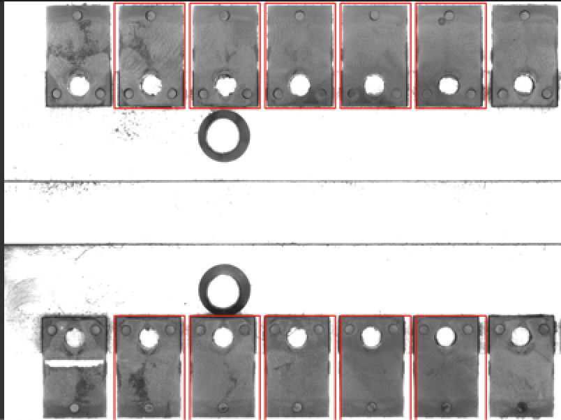
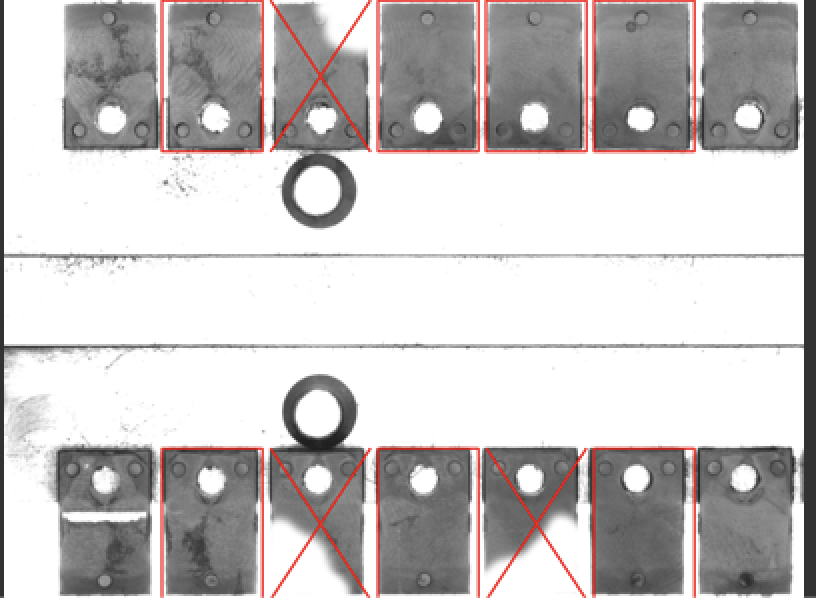
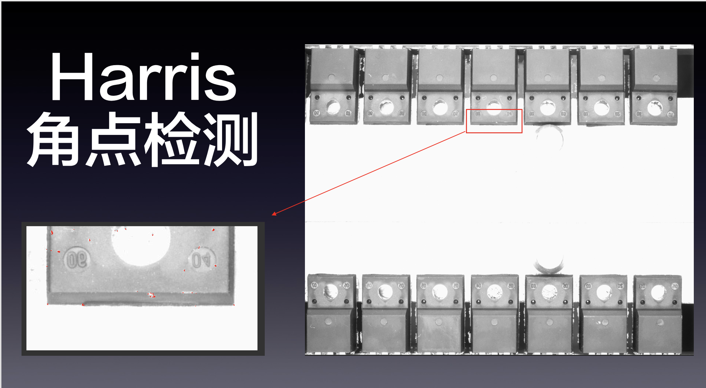
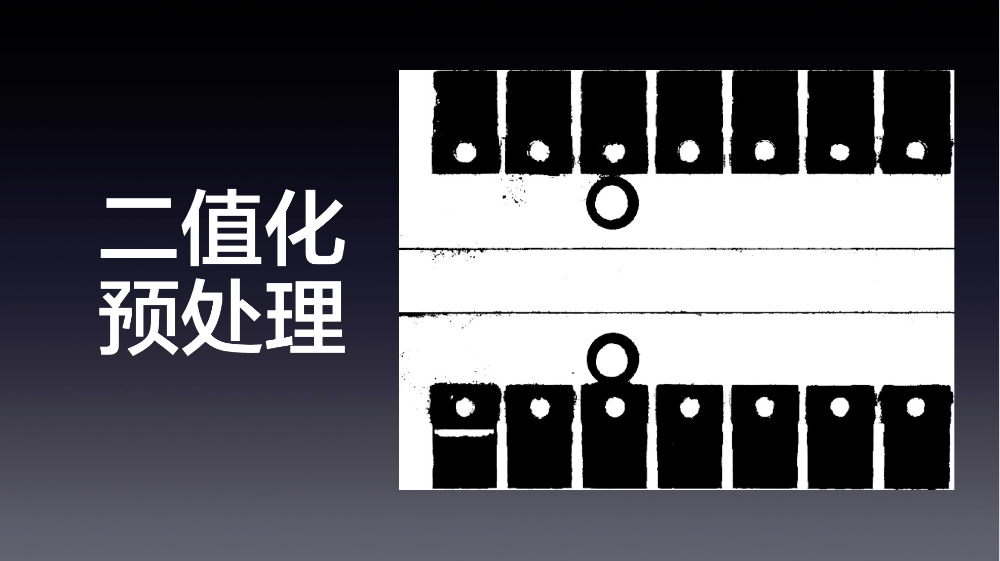
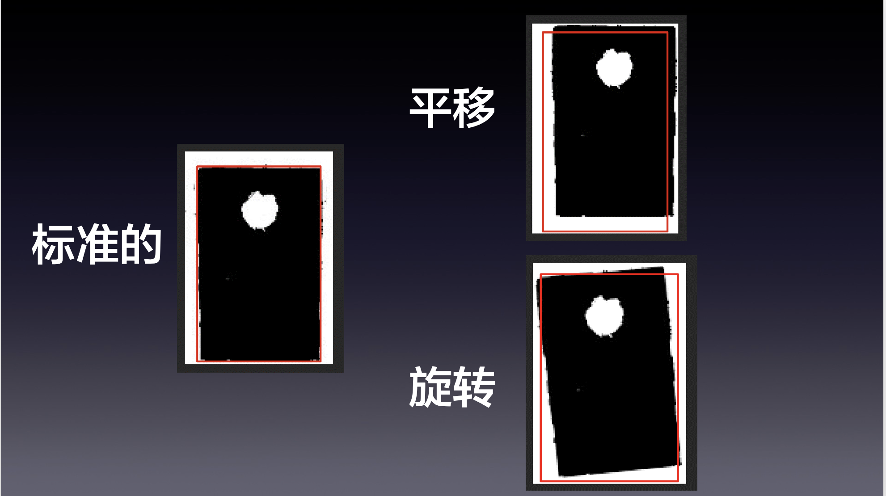

# 简介

2019年我大学毕业设计的检测芯片残缺效果展示

# 环境

* python3
* python的opencv环境
* tkinter
* 其他python常用库

# 前提

* 每张图片上芯片位置可以认为基本不变.这个由外部机械精度保持
* 拍摄的图片采用高光处理,黑白分明,因此可以二值化处理
* 芯片类型不同,要处理大小不同的各种芯片,但都为矩形

# 流程

## 预处理

1. 用户在模板图片上,标定框芯片位置
2. 根据用户标定位置,使用opencv Harris脚点检测算法,在模板图上生成实际的检测框
3. 用户判断检测框是否满足要求,否则重新进行1

## 检测

当检测到出问题的芯片时,将这张出问题图片保存.符合要求的芯片画矩形,不满足要求画X.结果类似如下.

# 原理

根据用户划定的矩形框做Harris脚点检测,判断出芯片的四角

芯片位置基本不变,因此可以认为每张图片,芯片位置都固定.将用户的数据序列化保存.

因此用户在模板上画完后,可以认为这个坑中会来对应的芯片.

芯片残缺则在图片上可以显示为白色.图片二值化后,对对应位置的坑位中的图像,计算黑色像素点数量.当不满足阈值时,认为芯片残缺.

此阈值用户可调

# 优化

直接划定刚刚好检测区域的方法鲁棒性较差.因此优化为可以在检测区域中添加白边(不处理区域).

实际检测中,检测的区域为实际区域+白边大小,但是会扣除白边的像素点.然后对认为有效的区域求黑色像素所占比重.

此添加白边的方法可以应对芯片略微旋转,平移的问题

